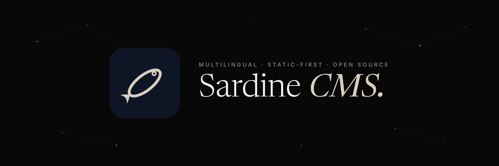

<p align="center">
  
</p>

# Stillsite

[](https://github.com/ph7x-Systems/stillsite/actions/workflows/ci.yml)
[](LICENSE)
[](pyproject.toml)
[](pyproject.toml)
[](pyproject.toml)

Reusable multilingual, static-first CMS framework extracted from the pH7x Systems website architecture.

> **License:** [Apache-2.0](LICENSE) (see [ADR-0002](docs/adr/0002-license-apache-2.md)).

## What it is

A static-first, multilingual content and publishing engine (EN as source + PT-PT, ES, FR, DE), built on the contracts proven on the public ph7x.com site:

- structured content in JSON and Markdown articles, separated from presentation;
- strong validation before publishing (language parity, structure, editorial rules);
- deterministic build with static export ready for Azure Static Web Apps;
- multilingual SEO: canonical, hreflang, Open Graph, JSON-LD, sitemap and RSS;
- authenticated admin panel with a `draft → review → published → archived` workflow.

## Structure

```text
apps/
  admin/                        # admin panel (API + UI)
packages/
  cms-core/                     # content model, schemas, translation states
  cms-build/                    # deterministic static generator, themes, targets
  cms-validation/               # configurable validation rules
  cms-cli/                      # the cms command line
  cms-theme-ph7x-reference/     # reference theme (tokens, components, local fonts)
examples/
  multilingual-company-site/    # example site with fictional content in 5 languages
docs/                           # architecture, plan, ADRs
tests/                          # unit and integration tests
```

## Status

Early development, in the open. The content core (models, translation states, multi-engine storage, deterministic export) is implemented and tested; the validator, builder and CLI are next — see [docs/PLAN.md](docs/PLAN.md) for the execution plan, [docs/POC_PLAN.md](docs/POC_PLAN.md) for the proof-of-concept target and [docs/BRIEF.md](docs/BRIEF.md) for the full brief. No secrets, personal data or client content live in this repository.

## Local development

Requires Python 3.12+.

```bash
python3 -m venv .venv && source .venv/bin/activate
python -m pip install --upgrade pip
python -m pip install --group dev            # ruff, mypy, pytest
python -m pip install -e packages/cms-core -e packages/cms-validation \
                      -e packages/cms-build -e packages/cms-cli

ruff check . && ruff format --check .        # lint
mypy                                         # type checking (strict)
pytest                                       # tests
```

CI (GitHub Actions) runs the same checks plus a docs link check, a secret
scan and an end-to-end example build on every push and pull request.

## Quickstart

```bash
cms seed     -p examples/multilingual-company-site   # fictional content, 5 languages
cms validate -p examples/multilingual-company-site   # rules; non-zero exit on errors
cms build    -p examples/multilingual-company-site   # deterministic _site/
cms export   -p examples/multilingual-company-site --target swa   # or nginx | generic
cms preview  -p examples/multilingual-company-site   # serve locally
```

## Principles

1. Static-first — the public frontend is static HTML/CSS/JS.
2. Content separated from presentation — zero editorial text in templates.
3. Multilingual from the ground up, with translation states and parity validation.
4. Portability — JSON and Markdown, no database lock-in.
5. Deterministic build and mandatory validation before publishing.
6. Security, accessibility (WCAG 2.2 AA) and Azure compatibility.
